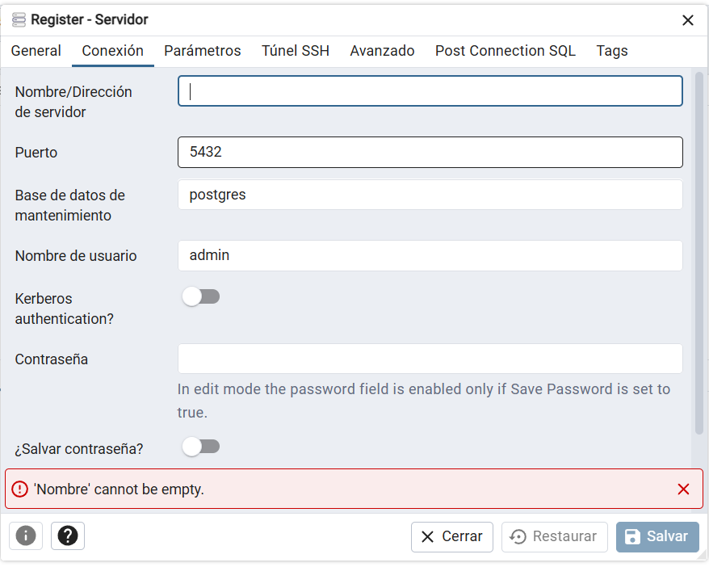
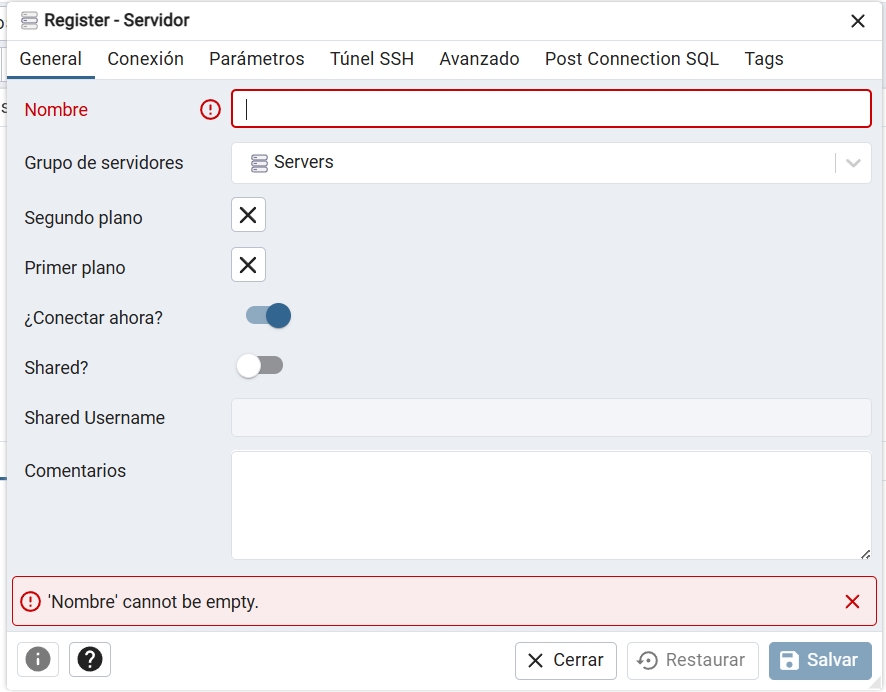
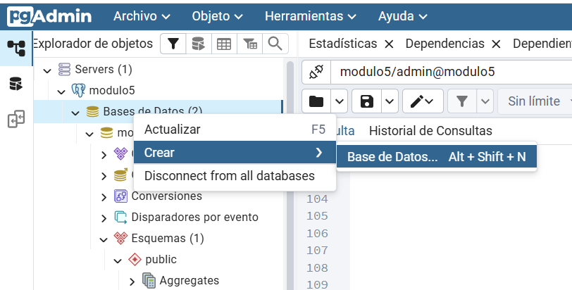
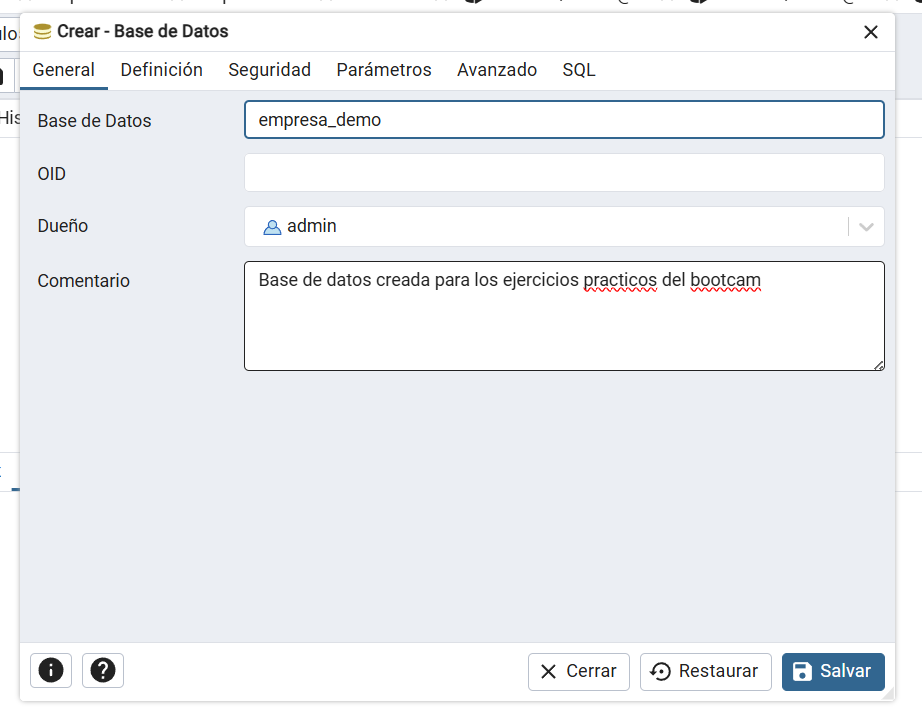
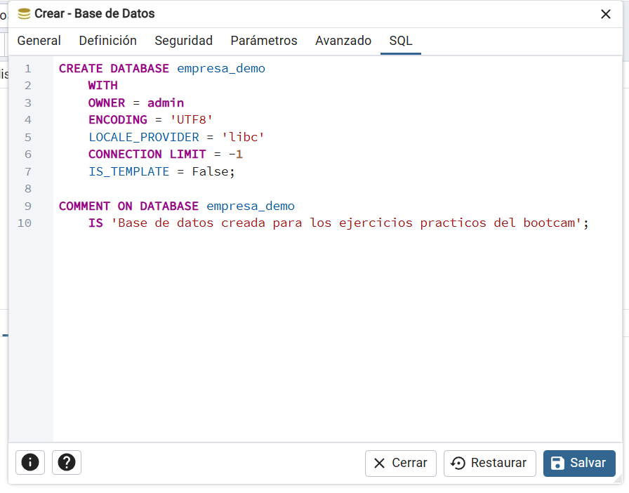
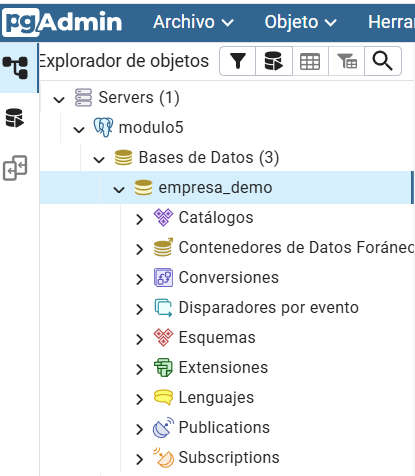

1. El rol de una base de datos

     • Explica con tus palabras cuál es el rol de una base de datos relacional dentro de una    empresa u organización.

     Su rol principal no es solo guardar datos, sino conectarlos de forma lógica para que la organización pueda tomar decisiones basadas en la realidad y no en suposiciones.
     su función es asegurar que la información sea consistente, segura y fácil de consultar

     • Menciona 3 ejemplos concretos de uso (por ejemplo: sistema de ventas, gestión de usuarios,
     inventario).

     1. Sistema de Ventas (E-commerce)
     La base de datos relaciona al comprador, el producto y el pago. Permite generar reportes de qué productos son los más vendidos y quiénes son los clientes más fieles. Sin una base relacional, sería imposible saber qué hay en un carrito de compras sin mezclarlo con el de otro usuario

     2. Gestión de Recursos Humanos (RRHH)

     Relaciona el perfil del trabajador con su puesto, su sueldo, sus vacaciones y sus beneficios. Esto facilita el cálculo automático de nóminas y el seguimiento de capacitaciones.

     3. Control de Inventario y Logística

     Conecta los proveedores con los artículos y los almacenes. Cuando un producto sale de la bodega, la base de datos actualiza el stock automáticamente y, si llega a un nivel mínimo, puede generar una alerta de "necesidad de reabastecimiento".

 2. Características de un RDBMS
    • Define qué es un RDBMS y nombra al menos 3 características que lo diferencian de otros tipos de sistemas de almacenamiento.

     Es el software que sirve como interfaz entre la base de datos física y los usuarios. A diferencia de una base de datos simple (que es solo el conjunto de datos), el RDBMS es el motor que administra, protege y permite consultar esos datos utilizando el lenguaje SQL

    • Menciona 3 RDBMS ampliamente usados en la industria y en qué contextos se suelen utilizar.

     PostgreSQL: para proyectos complejos y científicos. Se usa mucho en startups y empresas tecnológicas porque es de código abierto, muy potente y permite manejar datos geográficos y estructuras complejas.

     MySQL: El estándar para el desarrollo web. Es el motor que impulsa a WordPress y muchísimas aplicaciones en línea. Se elige por su velocidad de lectura y facilidad de implementación en servidores compartidos.

     Microsoft SQL Server: Muy utilizado en el entorno corporativo/empresarial que ya utiliza ecosistemas de Microsoft. Es ideal para grandes bancos o sistemas de gestión interna (ERPs) por su excelente integración con herramientas de análisis de datos y seguridad de nivel empresarial.

3. Herramientas y objetos
      ¿Qué herramientas gráficas y de línea de comandos se pueden usar para consultar bases de datos? Menciona al menos dos.

      psql (para PostgreSQL): Es la utilidad oficial de terminal para gestionar Postgres. Permite ejecutar consultas SQL, ver la estructura de las tablas y administrar permisos.

      pgAdmin: Específicamente diseñada para PostgreSQL. Es muy completa y permite gestionar desde la creación de tablas hasta el monitoreo del rendimiento del servidor mediante gráficos.

     Describe brevemente qué función cumple cada uno de estos objetos dentro de una base de  datos:
          Tabla: Es el objeto básico de almacenamiento. Organiza los datos en filas (registros) y columnas (campos). Es donde reside físicamente la información.

          Vista: Es una "tabla virtual". No almacena datos por sí misma, sino que es una consulta guardada que muestra datos de una o más tablas. Sirve para simplificar consultas complejas o por seguridad (ocultar columnas sensibles).

          Índice:Es una estructura de datos que mejora la velocidad de búsqueda. Funciona como el índice de un libro: permite al motor encontrar un registro sin tener que leer toda la tabla fila por fila.

          Llave primaria: Es un campo (o conjunto de campos) que identifica de forma única e irrepetible a cada fila de una tabla. Por ejemplo, el número de cédula o un ID de producto. No puede haber valores nulos ni duplicados.

          Llave foránea:Es una columna que crea un vínculo entre dos tablas. Es la "llave primaria" de una tabla que aparece en otra para relacionarlas. Asegura la integridad referencial (no puedes tener un pedido de un cliente que no existe).

4. Práctica guiada (si tienes PostgreSQL, SQLite o MySQL instalado)
 (Opcional, solo si cuentas con un entorno configurado)
 • Crea una base de datos vacía llamada empresa_demo.
 • Muestra cómo se establece la conexión utilizando una herramienta como psql, DBeaver, MySQL
 Workbench o SQLiteStudio.
 • Documenta los pasos seguidos con comandos o capturas de pantalla.      

     